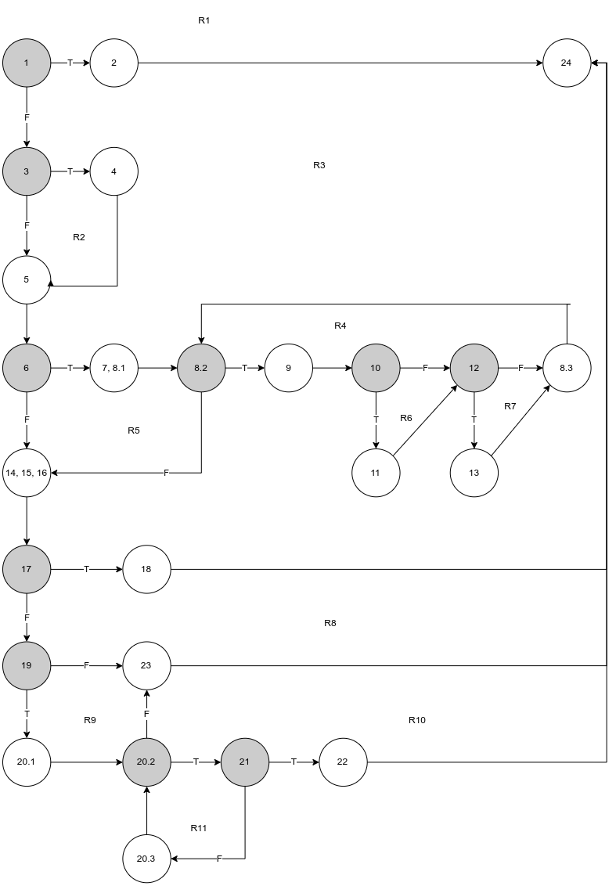

Софтверско инженерство - Втора лабораториска вежба
===

Даријан Шекеров 216055

## Control Flow Graph

 

## Цикломатска комплексност

Графот има 25 темиња и 34 ребра, па според Ојлерова формула, 
графот има `r = e - v + 2` региони, односно 34 - 25 + 2 = **11 региони**.

Друг начин со кој можеме да го пресметаме бројот на региони е 
да го изброиме бројот на предикатни јазли (обоени со сиво).
Тука имаме 10 такви, па ќе имаме 10 + 1 = **11 региони**.

За појасна слика, сите региони се нумерирани на сликата.

## Тест случаи според *Every Branch* критериумот

|Ребро|`user=null, allUsers=null`|`user=User("darijansekerov", "darijansekerov!", "darijansekerov.com"), allUsers={user}`|`user=User("darijan", "sekerov@", "darijan@sekerov.com"), allUsers={}`| `user=User(null, "sekerov asd", "darijan@sekerov.com"), allUsers={User("darijan@sekerov.com", "sekerov asd", "darijan@sekerov.com")}`|`user=User(null, "sekerov asd", "darijan@sekerov.com"), allUsers={User("darijan456@sekerov.com", "sekerov asd", "darijan123@sekerov.com")}`|
|---|-:|-:|-:|-:|-:|
|1-2|\*||
|1-3||\*|\*|\*|\*|
|2-24|\*||||||
|3-4||||\*|\*|
|3-5||\*|\*|||
|4-5||||\*|\*|
|5-6||\*|\*|\*|\*|
|6-7,8.1|||\*|\*|\*|
|6-14,15,16||\*||||
|7,8.1-8.2|||\*|\*|\*|
|8.2-9||||\*|\*|
|8.2-14,15,16|||\*|\*|\*|
|9-10||||\*|\*|
|10-11||||\*||
|10-12|||||\*|
|11-12||||\*||
|12-8.3|||||\*|
|12-13||||\*||
|13-8.3||||\*||
|8.3-8.2||||\*|\*|
|14,15,16-17||\*|\*|\*|\*|
|17-18||\*||||
|17-19|||\*|\*|\*|
|18-24||\*||||
|19-23||||\*|\*|
|19-20.1|||\*|||
|23-24||||\*|\*|
|20.1-20.2|||\*|||
|20.2-23|||\*|||
|20.2-21|||\*|||
|21-22|||\*|||
|21-20.3|||\*|||
|22-24|||\*|||
|20.3-20.2|||\*|||

`user=null, allUsers=null` - треба да се фрли исклучокот (корисникот е null)

`user=User("darijansekerov", "darijansekerov!", "darijansekerov.com"), allUsers={user}` - корисникот нема правилен мејл и корисничкото име се содржи во лозинката и веќе постои ист корисник

`user=User("darijan", "sekerov@", "darijan@sekerov.com"), allUsers={}` - корисникот има правилни податоци и нема веќе постоечки корисници

`user=User(null, "sekerov asd", "darijan@sekerov.com"), allUsers={User("darijan@sekerov.com", "sekerov asd", "darijan@sekerov.com")}` - корисникот нема корисничко име (се зема мејл адресата како корисничко име), но има ист таков корисник во листата на корисници и лозинката е невалидна

`user=User(null, "sekerov asd", "darijan@sekerov.com"), allUsers={User("darijan456@sekerov.com", "sekerov asd", "darijan123@sekerov.com")}` - корисникот нема корисничко име и има невалидна лозинка, но е различен со корисникот во листата

## Тест случаи според *Multiple Condition* критериумот

`if (user==null || user.getPassword()==null || user.getEmail()==null)`

```java
// TXX - корисникот е null
final List<User> emptyList = new ArrayList<>();
assertThrows(RuntimeException.class, () -> SILab2.function(null, emptyList));

// FTX - корисникот не е null, но лозинката е
final User userWithNullPassword = new User("user", null, null);
assertThrows(RuntimeException.class, () -> SILab2.function(userWithNullPassword, emptyList));

// FFT - ни корисникот ни лозинката не се null, но мејлот е
final User userWithNullEmail = new User("user", "pass", null);
assertThrows(RuntimeException.class, () -> SILab2.function(userWithNullEmail, emptyList));

// FFF - ништо не е null
final User validUser = new User("user", "pass", "email@email.com");
assertDoesNotThrow(() -> SILab2.function(validUser, emptyList));
```

